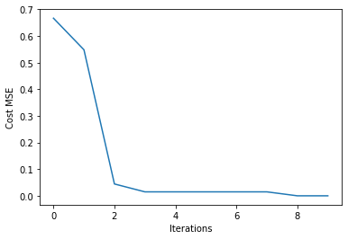
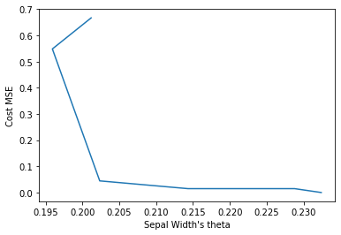
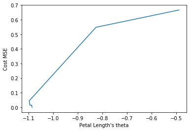
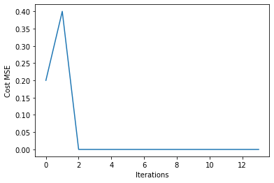
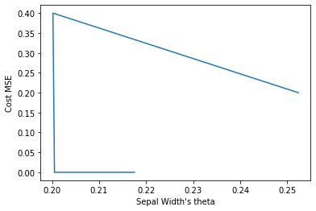
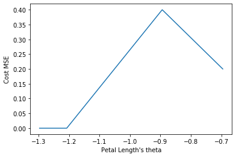

# Single Layer Neuron Network Implementation from Scratch In Python
 Using single layer Binary Threshold Neurons or TLUs (Threshold Logic Unit)  network to classify “Iris” data set
 
### author: Yi Rong
### date: 07/14/21
---

#### 1.Build a single layer Perceptron with binary threshold neurons.

The two formulas below are used in the code, where θ is the coefficient/ weight:


```
# define a class as perceptron
class Perceptron():
    
    # initialize learning_rate, epochs and batch_size
    def __init__(self, learning_rate = 1, epochs = 50, batch_size = 10):
        self.learning_rate = learning_rate
        self.epochs = epochs
        self.batch_size = batch_size
    
    # define a binary threshold as activation function
    def activation_binary(self, X, theta): 
        # theta: theta[0] is the bias, theta[1:] are the coefficients for all features
        z = np.dot(X, theta)  
        return np.where(z >= 0, 1, 0)
    
    # define gradient based on the formula Gradient
    def gradient(self, X, y, theta):
        pred = self.activation_binary(X, theta) # pred: prediction results
        grad = np.dot(X.transpose(), (pred - y)) 
        return grad /  X.shape[0]
    
    # define MSE cost function based on the formula MSE Cost
    def cost_mse(self, X, y, theta): 
        pred = self.activation_binary(X, theta)
        J = np.dot((pred - y).transpose(), (pred - y)) 
        J = 2 * J / X.shape[0]
        return J[0]
    
    # split data into mini batches
    def get_mini_batches(self, X, y): 
        mini_batches = [] 
        data = np.hstack((X, y)) 
        np.random.shuffle(data) 
        n_minibatches = data.shape[0] // self.batch_size 
        i = 0

        for i in range(n_minibatches): 
            mini_batch = data[i * self.batch_size:(i + 1) * self.batch_size, :] 
            X_mini = mini_batch[:, :-1] 
            Y_mini = mini_batch[:, -1].reshape((-1, 1)) 
            mini_batches.append((X_mini, Y_mini)) 
            
        if data.shape[0] % self.batch_size != 0: 
            mini_batch = data[i * self.batch_size:data.shape[0]] 
            X_mini = mini_batch[:, :-1] 
            Y_mini = mini_batch[:, -1].reshape((-1, 1)) 
            mini_batches.append((X_mini, Y_mini)) 
        return mini_batches     
  
    # fit model using gradient decent
    def gradientDescent_fit(self, X, y): 
        
        theta = np.zeros((X.shape[1], 1)) # initialize theta with 0
        error_list = []
        theta_list = []
        for itr in range(self.epochs):

            mini_batches = self.get_mini_batches(X, y)
            for mini_batch in mini_batches:
                X_mini, y_mini = mini_batch
                g = self.gradient(X_mini, y_mini, theta) # get new gradient
                theta = theta - self.learning_rate * g # update theta
                error_list.append(self.cost_mse(X_mini, y_mini, theta)) 
                theta_list.append(theta)
        return theta_list, error_list
```

#### 2.Training Results

##### Use Batch Gradient Descent to adjust the weights.

##### a. Plot the MSE (Mean Square Error) as a function of iteration


##### b. Plot the MSE as a function of column 2 (Sepal Width) weights


##### c. Plot the MSE as a function of column 3 (petal length) weights


##### Use Stochastic Gradient Descent to adjust the weights. Mini-batch size of 10, learning rate of 1.0, with no regularization.

##### a. Plot the MSE (Mean Square Error) as a function of iteration


##### b. Plot the MSE as a function of column 2 (Sepal Width) weights


##### c. Plot the MSE as a function of column 3 (petal length) weights
